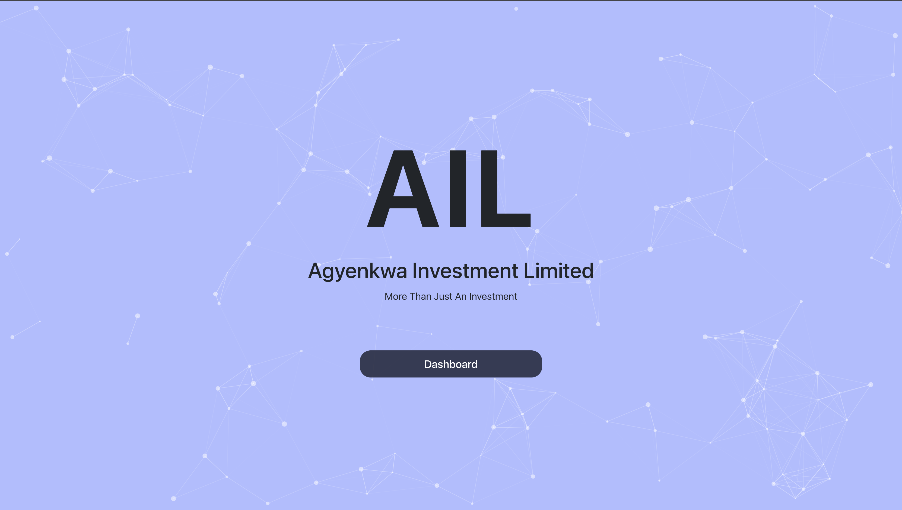

# Investment App

This project is the frontend of a full-stack web app for an investment company.

## Live Demo

This project is hosted on **Cloudflare**.
+ [Project Demo URL](https://iamupt.pages.dev)

### Table of contents

* General Info
* App Screenshot
* Description
* Technologies
* Future Additions

## General Info

This is a **hackathon project** that manages the investments of a madeup investment company. 
Pardon some of the app's flaws, I had to cook this up in a very limited time.

## Screenshot

## Description

The project task is as follows:

*You have been employed to as a developer to handle the software needs of an investment firm, Agyenkwa Investment Limited.
The firm is in the business of collecting money from it's clients periodically, and using the money to buy Treasury Bills on their behalf.*

*In a typically scenario,*

* *Mr. Kofi Ghana send 10% of his monthly salary to Agyenkwa Investment Limited. The amount deducted and used for investment is called the Principal*
* *Agyenkwa Investment Limited records the money received, and use that money to buy Treasury Bills at a particular interest rate for the client.*
* *On a monthly basis, Agyenkwa Investment Limited calculates the current value of all the active investments of Kofi Ghana and sends him the total value of his investments.*
* *As a hint to calculating the interest on the investment, use the Simple Interest Rate Formular = (Principal  Time  Rate) / 100)*

*As the Software Engineer contracted to do this job,* 

+ *develop an application that can be used to track the investment of Clients of Agyenkwa Investment Limited*
+ *the software should be able to tell the total principal amount of a client*
+ *the software should be able to tell the total interest accrued, and the total value of the investment at any particular day.*

## Technologies - Frontend

+ HTML / CSS
+ Bootstrap
+ Particles JS
+ React JS 

This project's backend uses Java (Spring boot), MySQL, Bitbucket pipelines and Heroku.  

## Future Work

To Be Considered ....
